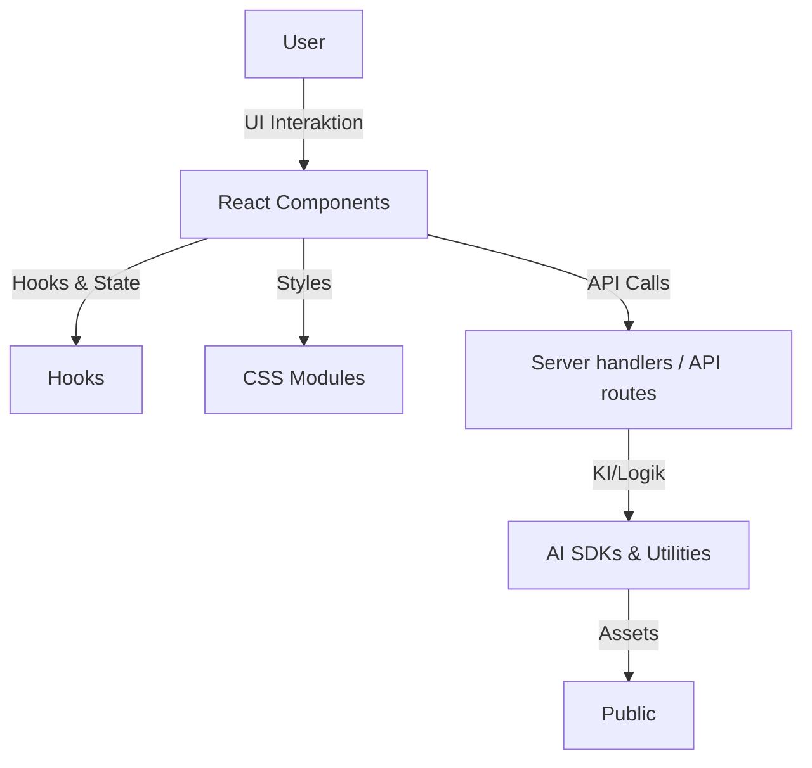

# Architektur-Dokumentation

## HIGH LEVEL UNDERSTANDING

Dieses Projekt ist eine moderne, modulare Webanwendung, die auf TanStack Start (mit Vite) und React basiert. Die Architektur folgt dem Prinzip der Trennung von Präsentation, Logik und Datenzugriff. Die wichtigsten Bereiche sind:

- **Frontend**: React-Komponenten, CSS-Module, Hooks für State- und Logikverwaltung.
- **Backend/API**: Next.js API-Routen für serverseitige Logik und KI-Integration.
- **Utilities**: Hilfsfunktionen und wiederverwendbare Logik in `utils` und `hooks`.
- **Assets**: Statische Dateien im `public`-Verzeichnis.



## TECHNOLOGY STACK

- **Frameworks:** TanStack Start (Vite), React
- **Sprache:** TypeScript, JavaScript
- **Styling:** CSS Modules
- **KI & Speech:** @ai-sdk/azure, @ai-sdk/react, ai, react-speech-recognition, react-text-to-speech
- **Hilfsbibliotheken:** imgbb-uploader, react-markdown, react-icons, react-use, remark-gfm, siriwave, zod
- **Build & Tools:** ESLint, Typescript, raw-loader

## DESIGN DECISIONS

- **TanStack Start (mit Vite) als Basis:** Nutzt Vite für Entwicklung und Build; bietet file-based routing via routesDirectory oder route-objects sowie Server-Handler für API-Routen.
- **Modulare Komponentenstruktur:** Wiederverwendbare UI-Komponenten in `src/components`.
- **Hooks für State-Management:** Eigene Hooks in `src/hooks` kapseln Logik und fördern Wiederverwendbarkeit.
- **API-Routen:** Serverseitige Logik und KI-Integration über Next.js API-Routen in `src/app/api`.
- **TypeScript:** Für Typensicherheit und bessere Wartbarkeit.
- **CSS Modules:** Kapselung von Styles pro Komponente.
- **KI-Integration:** Nutzung von AI SDKs für Sprach- und Bildverarbeitung.

## GETTING STARTED

1. **Repository klonen**
   ```bash
   git clone https://github.com/schirkan/ai-demo.git
   cd ai-demo
   ```
2. **Abhängigkeiten installieren**
   ```bash
   npm install
   ```
3. **Entwicklungsserver starten**
   ```bash
   npm run dev
   ```
   Die Anwendung ist dann unter [http://localhost:3000](http://localhost:3000) erreichbar.
4. **Build für Produktion**
   ```bash
   npm run build
   npm start
   ```

## ENTRY POINTS

- **Frontend:** `src/app/index.tsx` – Hauptseite der Anwendung. Bei TanStack Start wird `src/app/__root.tsx` für das Root-Layout und `src/app/index.tsx` (createFileRoute) für die Root-Route empfohlen.
- **API:** `src/app/api/` – Server handlers / API routes (bei TanStack Start als server.handlers / createServerFn nutzbar).
- **Komponenten:** `src/components/` – Wiederverwendbare UI-Bausteine.
- **Hooks:** `src/hooks/` – Eigene React-Hooks für Logik und State.
- **Utils:** `src/utils/` – Hilfsfunktionen für verschiedene Aufgaben.

## COMPONENTS

### App-Komponenten (`src/app/`)

- **Purpose:** Einstiegspunkt und Routing der Anwendung.
- **Strukturen:** Next.js Pages, API-Routen.
- **Design Patterns:** File-based Routing, SSR/SSG.
- **Regeln:** Jede Seite/Route als eigene Datei.

### UI-Komponenten (`src/components/`)

- **Purpose:** Wiederverwendbare UI-Bausteine (z.B. ChatInput, ChatLog, ImageDisplay).
- **Strukturen:** Funktionale React-Komponenten, CSS Modules.
- **Design Patterns:** Presentational/Container Pattern.
- **Regeln:** Keine Logik in UI-Komponenten, nur Darstellung.

### Hooks (`src/hooks/`)

- **Purpose:** Kapselung von State- und Logik (z.B. Chat-Verlauf, Bildgenerierung).
- **Strukturen:** Custom React Hooks.
- **Design Patterns:** Hook Pattern.
- **Regeln:** Hooks sind zustandslos und wiederverwendbar.

### Utilities (`src/utils/`)

- **Purpose:** Hilfsfunktionen für Bildverarbeitung, Nachrichtenhandling etc.
- **Strukturen:** Einfache Funktionen.
- **Design Patterns:** Utility Pattern.
- **Regeln:** Keine Seiteneffekte, reine Funktionen.

### API-Routen (`src/app/api/`)

- **Purpose:** Serverseitige Endpunkte für Chat, Bildgenerierung, Quizshow etc.
- **Strukturen:** Next.js API Route Handler.
- **Design Patterns:** RESTful, KI-Integration.
- **Regeln:** Trennung von Logik und Routing.

## CODE MAP

**Wichtige Verzeichnisse:**

- `src/app/` – Hauptanwendung, Seiten, API-Routen
- `src/components/` – UI-Komponenten
- `src/hooks/` – Eigene React-Hooks
- `src/utils/` – Hilfsfunktionen
- `src/css/` – Globale und modulare Styles
- `public/` – Statische Assets (Bilder, JS)

**API-Überblick:**

- `/api/chat` – Chat-Endpoint (KI-Integration)
- `/api/image` – Bildgenerierung
- `/api/quizshow` – Quizshow-Logik
- `/api/summarize` – Textzusammenfassung
- `/api/custom-gpt` – Custom GPT-Logik

**Wichtige Dateien:**

- `package.json` – Projektkonfiguration und Abhängigkeiten
- `tsconfig.json` – TypeScript-Konfiguration
- `vite.config.mts` (oder `vite.config.ts`) – Vite + TanStack Start Plugin Konfiguration (ersetzt `next.config.ts` nach Migration)
- `README.md` – Projektübersicht
